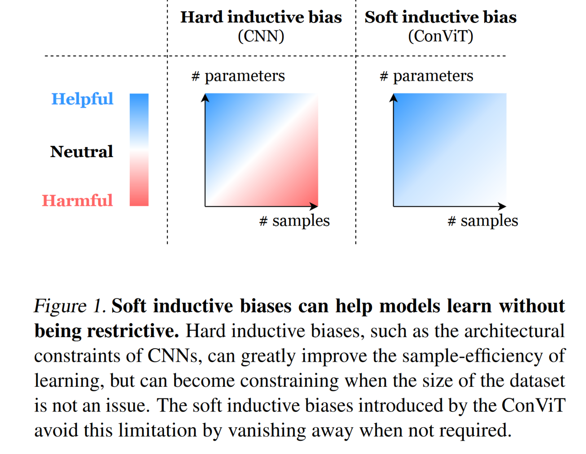
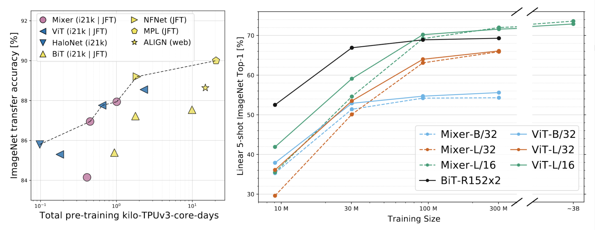
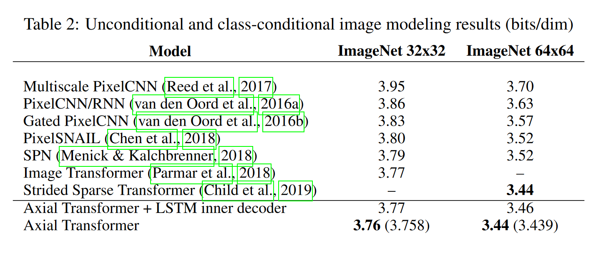
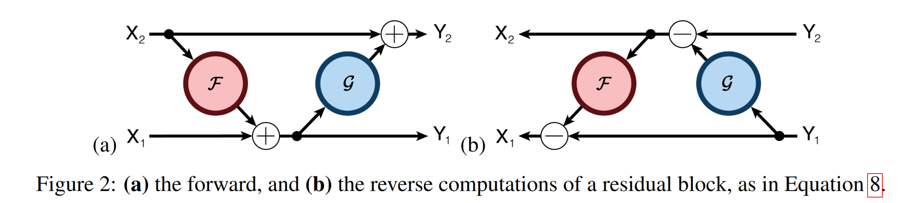
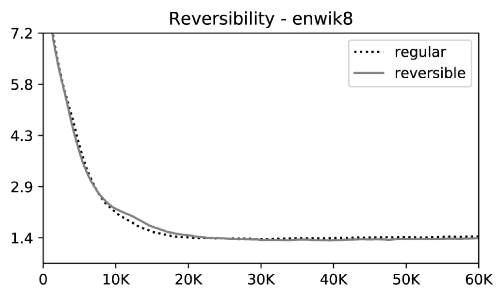
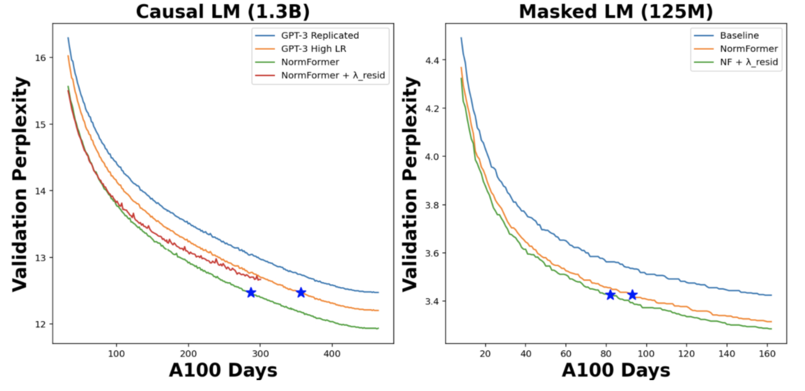
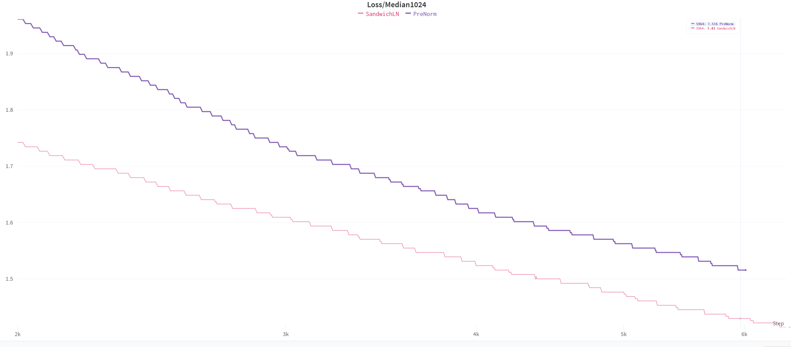
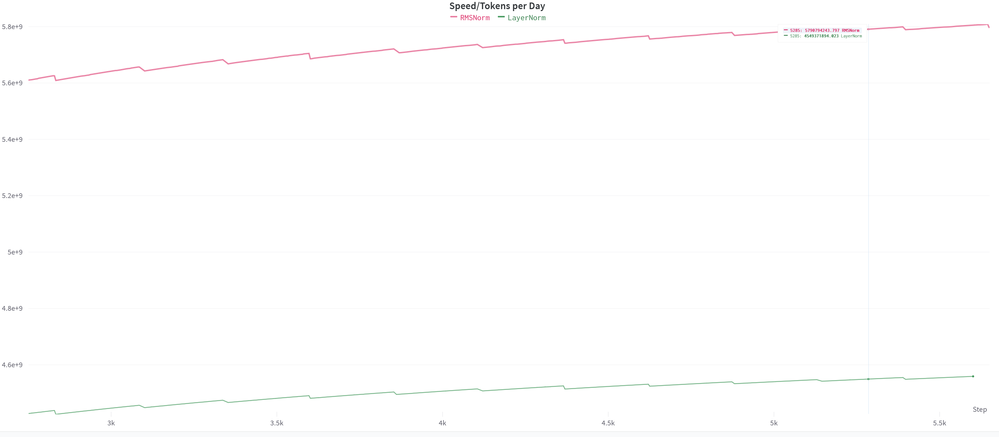

# Olmax

Optimized Language-Model (in jax)

## Techniques

Olmax is a collection of various techniques otherwise rarely used in language modeling. The sections below will describe
their purpose.

### Model

#### Convolution

Most modern language models use attention as their core building block. However, works such
as [Conformer](https://arxiv.org/abs/2005.08100) and noticed that combining attention with convolution, instead of
attention with feed forward layers, leads to better evaluation performance at little overhead. Later works, such
as [Nyströmformer](https://arxiv.org/abs/2102.03902) explicitly introduced a convolution in the residual branch to add a
hard locality bias to their model. Concurrent work, such as [ALiBi](https://arxiv.org/abs/2108.12409)
, [Swin](https://arxiv.org/abs/2103.14030) and [ConViT](https://arxiv.org/abs/2103.10697) pointed out that soft
inductive biases are nearly always helpful.

However, as soft biases such as ALiBi do not leverage structured sparsity as a convolution does, as it still computes
attention to tokens it will never attend to, and convolution by itself already adds a decent chunk of performance, we
decided to take this as our core building block.

Another advantages convolutions have is that they scale linearly with increased sequence length, which makes them
perfect for deployment in long-context applications. Additionally, convolutions have more parameters at the same memory
cost, giving the model more freedom without increasing memory usage. For example, a 3x3 convolution has precisely
9-times as many weights as a 1x1 convolution, which is most commonly used in a transformer, without requiring larger
intermediate states.\
In summary, convolutions provide a memory-efficient way of adding a locality bias to any model. As most domains, such as
text, image and video, have a strong locality bias, their usage is sensible.

#### Axial MLP-Mixer

Unfortunately, replacing global attention with local convolution does not yield the best performance in most cases. Some
papers, such as [ConvBERT](https://arxiv.org/abs/2008.02496) illustrated that it is possible to achieve competitive
performance with convolutions, but only after spending significant engineering efforts on it and using
non-autoregressive attention. Therefore, a second, global mixing method needs to be used, together with convolution.\
According to recent research, [MLP-Mixer](https://arxiv.org/abs/2105.01601) scales better than attention when training
large enough models on significant amounts of data. As language modeling is a domain with predominantly large models and
massive datasets, it seems like a good fit. Additionally, MLP-Mixer is faster to compute and requires less memory than
attention, making it a perfect fit for a memory-efficient model.

Additionally, concurrent work pointed out that axial attention performs well on images in the pixel level, while also
running quickly and with a small memory footprint of O(N^1.5) instead of O(N^2).

Therefore, an axial mlp-mixer needs less memory and compute than a standard transformer while providing better
performance at scale.

#### Reversible

Most commonly, large transformers use [activation checkpointing](https://arxiv.org/abs/1604.06174v2), which saves the
input to a function and recomputes its intermediate values. While activation checkpointing means not all intermediate
values, such as attention maps, have to be stored simultaneously, the model still has to store the input to all of these
functions. However, [recent research](https://arxiv.org/abs/1707.04585) indicates that a slight modification in model
architecture can make the model fully reversible, allowing even those "checkpoints" to be recomputed as they're needed.

Additionally, [Reformer](https://arxiv.org/abs/2001.04451) pointed out that reversible layers have the same loss curve
as non-reversible layers when trained at scale, indicating that they fit this use-case perfectly.

Using reversible layers, the network can be scaled to any depth, without increasing the memory usage except for the
increased number of parameters. This way, architectures such as [DeepNarrow](https://arxiv.org/abs/2109.10686) can be
used efficiently.

#### Normalization

For a long time, people have discussed whether the BERT-style PostNorm or GPT-style PreNorm is best. However, recent
research, such as [CogView's SandwichLN](https://arxiv.org/abs/2105.13290)
and [NormFormer](https://openreview.net/pdf?id=GMYWzWztDx5) showed that using both PostNorm and PreNorm improves
stability and with that convergence.

Testing it in this codebase gives similar results to those of NormFormer, showing that SandwichLN converges
significantly better than PreNorm, reaching lower losses in less time.

Additionally, [RMSNorm](https://arxiv.org/abs/1910.07467), as used by
DeepMind's [Gopher-280B](https://arxiv.org/abs/2112.11446), decreases the loss by another
3% when comparing step by step. 
Additionally, RMSNorm is significantly simpler and less expensive than LayerNorm,
as `RMSNorm(x, scale) = x / Sqrt(Sum(Square(x))) * scale` and
`LayerNorm(x, scale, shift) = (x - Mean(x)) / (Mean(Square(x)) - Square(Mean(x))) * scale + shift`. So, even though
normalization takes up only a small fraction of the total runtime, replacing it with RMSNorm yields an immediate 27%
speedup for both training and inference.

#### MoE

### Optimizer

#### Shampoo

#### Adaptive Gradient Clipping

## Getting Started

### Tensorboard Trace

After SSHing into a TPU, it's recommended to run `bash setup.sh` as root to install the correct versions of libraries.\
This isn't done via a `requirements.txt` as some libraries have to be removed while others require a very specific
installation order.

Once that's done, you can run `python3 model.py` to start whatever model is configured in `context.py`.\
To change the config without touching the code, you could also run `python3 model.py config.json` and perform your
changes in `config.json`.

It's possible to get a tensorboard trace of memory and operations by changing `ctx.training.trace.do_trace` to `true`.
With that, a file in the possibly newly created folder named `ctx.training.trace.output_path` will be created containing
the trace.\
Using this trace, you can start a tensorboard server and inspect the current model performance. Something as simple
as `tensorboard --logdir trace --host 0.0.0.0 --port 6006` works perfectly fine.\
If the tensorboard doesn't show up, it's likely that the firewall is misconfigured. One easy way to fix this is to
run `gcloud compute firewall-rules create --network=default allow-tensorboard-tcp --allow=tcp:6006`, which creates a new
firewall rule allowing anyone to access, and with that force you to pay for what's hosted on, this port on the TPU.\